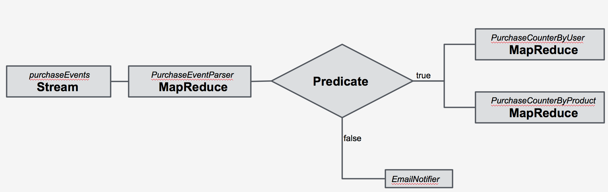

=================================================================
Parallel Execution of the Actions based on Condition in Workflow
=================================================================

The Workflow system in `Cask Data Application Platform (CDAP) <http://cdap.io>`__
allows specifying, executing, scheduling, and monitoring complex series of jobs
and tasks. In this guide, you will learn how it can facilitate the execution of
`MapReduce <http://research.google.com/archive/mapreduce.html>`__
programs in parallel based on the evaluation of boolean predicates.

What You Will Build
===================

This guide will take you through building a
`CDAP application <http://docs.cdap.io/cdap/current/en/developers-manual/building-blocks/applications.html>`__
that uses ingested raw purchase events (of the form '``<name> bought <n> <item>s for $<price>``', which are parsed
using a primitive parser for sentences) to compute in parallel the total purchases made by a customer along with
the total purchases made for a each product.

You will:

- Build ``PurchaseEventParser``, a
  `MapReduce program <http://docs.cdap.io/cdap/current/en/developers-manual/building-blocks/mapreduce-programs.html>`__
  to parse the raw purchase events and create ``Purchase`` objects from them;
- Build ``PurchaseCounterByCustomer``, a
  `MapReduce program <http://docs.cdap.io/cdap/current/en/developers-manual/building-blocks/mapreduce-programs.html>`__
  to count the purchases made per customer;
- Build ``PurchaseCounterByProduct``, a
  `MapReduce program <http://docs.cdap.io/cdap/current/en/developers-manual/building-blocks/mapreduce-programs.html>`__
  to count the purchases made per product;
- Build ``PurchaseWorkflow``, a
  `Workflow <http://docs.cdap.io/cdap/current/en/developers-manual/building-blocks/workflows.html>`__
  which will first execute the MapReduce program ``PurchaseEventParser``. If the predicate ``PurchaseEventVerifier``,
  which uses the MapReduce counters emitted by the PEP to determine data quality, evaluates to true, the workflow will
  in parallel execute the MapReduce program ``PurchaseCounterByCustomer`` and ``PurchaseCounterByProduct`` otherwise,
  it will execute the action ``ProblemLogger``;
- Use
  `Datasets <http://docs.cdap.io/cdap/current/en/developers-manual/building-blocks/datasets/index.html>`__
  to persist results of the MapReduce programs; and
- Build a
  `Service <http://docs.cdap.io/cdap/current/en/developers-manual/building-blocks/services.html>`__
  to serve the results via HTTP.

What You Will Need
==================

- `JDK 7 <http://www.oracle.com/technetwork/java/javase/downloads/index.html>`__
- `Apache Maven 3.1+ <http://maven.apache.org/>`__
- `CDAP SDK <http://docs.cdap.io/cdap/current/en/developers-manual/getting-started/standalone/index.html>`__

Let’s Build It!
===============

The following sections will guide you through building an application from scratch. If you
are interested in deploying and running the application right away, you can clone its
source code from this GitHub repository. In that case, feel free to skip the next two
sections and jump right to the
`Build and Run Application <#build-and-run-application>`__ section.

Application Design
------------------

The application will assume that the purchase events are ingested
into a Stream. The events can be ingested into a Stream continuously
in real time or in batches; whichever way, it doesn’t affect the ability
of the MapReduce programs to consume them.

The ``PurchaseWorkflow`` encapsulates the set of MapReduce programs, which extracts the required information from the
raw purchase events and computes the total purchases made by a each customer and total purchases made for a
each product in a specific time range. The results of the computation are persisted in Datasets.

Finally, the application contains a Service that exposes an HTTP endpoint to access the data stored in the Datasets.

Implementation
--------------

The first step is to construct our application structure. We will use a
standard Maven project structure for all of the source code files::

  ./pom.xml
  ./src/main/java/co/cdap/guides/workflow/ProblemLogger.java
  ./src/main/java/co/cdap/guides/workflow/Purchase.java
  ./src/main/java/co/cdap/guides/workflow/PurchaseCounterByProduct.java
  ./src/main/java/co/cdap/guides/workflow/PurchaseCounterByCustomer.java
  ./src/main/java/co/cdap/guides/workflow/PurchaseEventParser.java
  ./src/main/java/co/cdap/guides/workflow/PurchaseEventVerifier.java
  ./src/main/java/co/cdap/guides/workflow/PurchaseResultService.java
  ./src/main/java/co/cdap/guides/workflow/PurchaseWorkflow.java
  ./src/main/java/co/cdap/guides/workflow/PurchaseWorkflowApp.java

The CDAP application is identified by the ``PurchaseWorkflowApp`` class. This
class extends an `AbstractApplication
<http://docs.cdap.io/cdap/current/en/reference-manual/javadocs/co/cask/cdap/api/app/AbstractApplication.html>`__,
and overrides the ``configure`` method to define all of the application components:

.. code:: java

  public class PurchaseWorkflowApp extends AbstractApplication {
    @Override
    public void configure() {
      setName("PurchaseWorkflowApp");
      setDescription("Application describing the Workflow");

      addStream(new Stream("purchaseEvents"));

      addMapReduce(new PurchaseEventParser());
      addMapReduce(new PurchaseCounterByCustomer());
      addMapReduce(new PurchaseCounterByProduct());
      addWorkflow(new PurchaseWorkflow());

      scheduleWorkflow(Schedules.createTimeSchedule("HourlySchedule", "Schedule execution every 1 hour", "0 * * * *"),
                       "PurchaseWorkflow");

      addService(new PurchaseResultService());

      createDataset("purchaseRecords", KeyValueTable.class);
      createDataset("customerPurchases", KeyValueTable.class);
      createDataset("productPurchases", KeyValueTable.class);
    }
  }
  
The ``PurchaseWorkflowApp`` application defines a new `Stream
<http://docs.cdap.io/cdap/current/en/developers-manual/building-blocks/streams.html>`__
where purchase events are ingested. Once the data is
ingested, the events can be processed in real time or batch. In our
application, we will process the events in batch using the
``PurchaseWorkflow`` program and compute the total purchases made by a each customer
and the total purchases made for a each product in a specific time range. We will use three MapReduce
programs ``PurchaseEventParser``, ``PurchaseCounterByCustomer``, and ``PurchaseCounterByProduct`` to apply
different processing on the purchase events and the Workflow ``PurchaseWorkflow`` to connect these MapReduce
programs.

The result of the Workflow execution is persisted into Datasets; the
application uses the ``createDataset`` method to define the Dataset. We use three datasets:
``purchaseRecords`` to store the valid parsed purchase events; ``customerPurchases`` to store the total purchases
made by a each customer; and ``productPurchases`` to store the total purchases made for each product.
The ``Purchase`` class defines the type used to store the parsed purchase events.

The application also adds a custom Workflow action ``ProblemLogger``. When a Workflow executes a custom action,
it invokes the ``run`` method in the action. In ``ProblemLogger``, we only add a log statement; however it could be
customized to send emails to the concerned parties.

The ``PurchaseWorkflow`` is scheduled to execute every hour.

Finally, the application adds a service for querying the results from the Datasets.

Let's take a closer look at the Workflow.

The ``PurchaseWorkflow`` extends an `AbstractWorkflow
<http://docs.cdap.io/cdap/current/en/reference-manual/javadocs/co/cask/cdap/api/workflow/AbstractWorkflow.html>`__
class and overrides the ``configure`` method:

.. code:: java

  public class PurchaseWorkflow extends AbstractWorkflow {
    @Override
    protected void configure() {
      setName("PurchaseWorkflow");
      setDescription("Workflow to parse the purchase events and count the revenue per customer and per product");

      addMapReduce("PurchaseEventParser");

      condition(new PurchaseEventVerifier())
        .fork()
          .addMapReduce("PurchaseCounterByCustomer")
        .also()
          .addMapReduce("PurchaseCounterByProduct")
        .join()
      .otherwise()
        .addAction(new NotifyByEmail())
      .end();
    }
  }

In the ``configure`` method we specify the topology for connecting the programs which will run as a part of
the Workflow execution. As the first action in the ``PurchaseWorkflow``, we add the MapReduce program
``PurchaseEventParser``. This program will parse raw purchase events and create ``Purchase`` objects from them.

After that, we add a ``condition`` in the Workflow, which takes a predicate ``PurchaseEventVerifier``.
If the predicate evaluates to true, we ``fork`` the execution of the Workflow into two parallel branches.
One branch executes the ``PurchaseCounterByCustomer`` MapReduce program, while the other executes the
``PurchaseCounterByProduct`` MapReduce program.

If the predicate evaluates to false, then actions in the ``otherwise`` section will be executed.
We have added a single custom action, ``ProblemLogger`` to the ``otherwise`` section as an example
of what is possible.

Lets take a closer look at the predicate ``PurchaseEventVerifier``.

.. code:: java

  public class PurchaseEventVerifier implements Predicate<WorkflowContext> {

    @Override
    public boolean apply(WorkflowContext workflowContext) {
      if (workflowContext == null) {
        return false;
      }

      WorkflowToken token = workflowContext.getToken();
      if (token == null) {
        return false;
      }

      Map<String, Map<String, Long>> hadoopCounters = token.getMapReduceCounters();
      if (hadoopCounters == null) {
        return false;
      }

      Map<String, Long> taskCounter = hadoopCounters.get("org.apache.hadoop.mapreduce.TaskCounter");

      if (taskCounter.containsKey("MAP_INPUT_RECORDS")) {
        long mapInputRecordNumber = taskCounter.get("MAP_INPUT_RECORDS");
        long mapOutputRecordNumber = taskCounter.get("MAP_OUTPUT_RECORDS");
        // Return true if at least 80% of the records were successfully parsed and emitted
        // by previous map job
        return (mapOutputRecordNumber >= (mapInputRecordNumber * 80/100));
      }

      return false;
    }
  }

``PurchaseEventVerifier`` needs to be a public class which implements the interface ``Predicate<WorkflowContext>``.
The ``apply`` method in the predicate takes ``WorkflowContext`` as a parameter. The Hadoop counters emitted by
the previous MapReduce program (in our case ``PurchaseEventParser``) can be retrieved in this method using
the ``workflowContext`` object. We query for the number of input records to the mappers and the number of records
emitted by the mappers. If at least 80% of the records were successfully parsed and emitted as ``Purchase``
by the mappers, the method returns true and the ``fork`` in the Workflow will be executed. If the method
returns false, the ``otherwise`` section in the ``condition`` is executed, which contains the ``ProblemLogger``
custom action.

Build and Run Application
=========================

The ``PurchaseWorkflowApp`` can be built and packaged using the Apache Maven command::

  $ mvn clean package

Note that the remaining commands assume that the ``cdap-cli.sh`` script is
available on your PATH. If this is not the case, please add it::

  $ export PATH=$PATH:<CDAP home>/bin

If you haven't already started a standalone CDAP installation, start it with the command::

  $ cdap.sh start

We can then deploy the application to the standalone CDAP installation::

  $ cdap-cli.sh deploy app target/cdap-workflow-guide-<version>.jar

Next, we will send some sample purchase events into the stream
for processing::

  $ cdap-cli.sh send stream purchaseEvents \'bob bought 3 apples for \$30\'
  $ cdap-cli.sh send stream purchaseEvents \'joe bought 1 apple for \$100\'
  $ cdap-cli.sh send stream purchaseEvents \'joe bought 10 pineapples for \$20\'
  $ cdap-cli.sh send stream purchaseEvents \'cat bought 3 bottles for \$12\'
  $ cdap-cli.sh send stream purchaseEvents \'cat bought 2 pops for \$14\'

We can now start the Workflow to process the events that were
ingested::

  $ cdap-cli.sh start workflow PurchaseWorkflowApp.PurchaseWorkflow

The Workflow will take a couple of minutes to execute.

We can then start the ``PurchaseResultService`` and query the processed
results::

  $ cdap-cli.sh start service PurchaseWorkflowApp.PurchaseResultService

- Retrieve the purchase records for customer ``joe``::

  $ curl http://localhost:10000/v3/namespaces/default/apps/PurchaseWorkflowApp/services/PurchaseResultService/methods/purchaserecords/joe

  Example output::

  [{"customer":"joe","product":"pineapple","quantity":10,"price":20,"purchaseTime":1430962917227},{"customer":"joe","product":"apple","quantity":1,"price":100,"purchaseTime":1430962917227}]

- Retrieve the total purchases made by customer ``joe``::

  $ curl http://localhost:10000/v3/namespaces/default/apps/PurchaseWorkflowApp/services/PurchaseResultService/methods/purchases/customers/joe

  Example output::

  120

- Retrieve the total purchases made for product ``apple``::

  $ curl http://localhost:10000/v3/namespaces/default/apps/PurchaseWorkflowApp/services/PurchaseResultService/methods/purchases/products/apple

  Example output::

  160

You have now seen how to write a Workflow to connect different MapReduce programs and run them in
parallel based on a condition.

Related Topics
==============

- `CDAP MapReduce Guide <https://github.com/cdap-guides/cdap-mapreduce-guide>`__ tutorial for MapReduce
- `Wise: Web Analytics <http://docs.cdap.io/cdap/current/en/examples-manual/tutorials/wise.html>`__ tutorial, part of CDAP

Share and Discuss!
==================

Have a question? Discuss at the `CDAP User Mailing List <https://groups.google.com/forum/#!forum/cdap-user>`__.

License
=======

Copyright © 2015 Cask Data, Inc.

Licensed under the Apache License, Version 2.0 (the "License"); you may
not use this file except in compliance with the License. You may obtain
a copy of the License at

http://www.apache.org/licenses/LICENSE-2.0

Unless required by applicable law or agreed to in writing, software
distributed under the License is distributed on an "AS IS" BASIS,
WITHOUT WARRANTIES OR CONDITIONS OF ANY KIND, either express or implied.
See the License for the specific language governing permissions and
limitations under the License.
